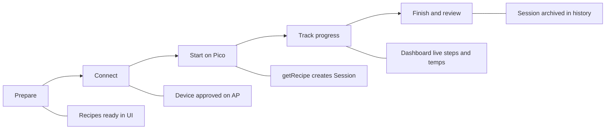
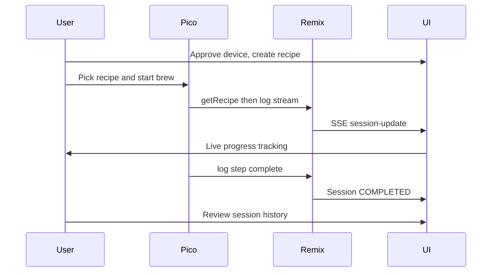

# Phase 1: Pico Brew Sessions on Raspberry Pi

**Product goal:** Users brew with a Pico C and track brew progress in this app — from recipe prep through live step/temp updates to a finished session record.

RePicoBrew already implements most of the Pico machine wire protocol under [`app/routes/api.pico.*.ts`](app/routes/). Phase 1 closes the loop: **Pi networking**, **API correctness**, then **UI** so you can register a device, manage recipes, run a brew, and track progress live.

**Locked decisions**

- Networking: Pi runs WiFi AP + dnsmasq (reference-style `PICOBREW` network); `picobrew.com` → Pi
- Recipes: full list + create/edit in Phase 1 (before first real brew)

**Out of scope (later phases):** Zymatic/ZSeries/PicoStill, Tilt/iSpindel/PicoFerm, cloud recipe import from old PicoBrew servers, i18n redesign

---

## User brew process (Phase 1 core)

Brew is started on the **machine** (Pico firmware picks a pak / recipe). This app **enables** the brew and **tracks** it end-to-end.

| Step    | User / machine            | App responsibility                                                                  |
| ------- | ------------------------- | ----------------------------------------------------------------------------------- |
| Prepare | Create or edit recipe     | Recipe CRUD; valid Pico steps                                                       |
| Connect | Pico joins `PICOBREW` AP  | DNS + register; approve device                                                      |
| Start   | User picks recipe on Pico | `getAssociatedPaks` / `getRecipe`; create brew `Session`                            |
| Track   | Pico streams `log`        | Live Dashboard: current step, time left, wort/therm, step checklist, animation, SSE |
| Finish  | Step contains "complete"  | Mark session COMPLETED; show summary; history entry                                 |

Progress tracking surfaces (must-have for Phase 1):

- **Current brew card:** recipe name, device, state, status text, time remaining
- **Step progress:** recipe steps with current/completed indicators driven by `log.step` / `event`
- **Live temps:** wort + therm over time (chart)
- **Brewing animation (already built):** [`BrewingAnimation`](app/components/BrewingAnimation/BrewingAnimation.tsx) takes `phase` + `temperature`; Dashboard today advances it manually via a “Next” button ([`Dashboard.tsx`](app/pages/Dashboard.tsx)). Phase 1 wires that animation to live brew logs — map Pico `step`/`event` → `Phase`, feed `wort`/`therm` as temperature, remove the manual stepper
- **Completion:** toast / Dashboard state when brew finishes; deep-link to session detail

---

## Stage 0 — Pi host + AP networking

Goal: Pico joins the Pi and hits this app as `picobrew.com` on port 80.

- Document and script AP setup (hostapd + dnsmasq): SSID/password, bridge/AP IP (e.g. `192.168.72.1`), `address=/picobrew.com/<pi-ip>`
- Add nginx (or equivalent) reverse proxy: `:80` → Remix (`8080` today in [`package.json`](package.json)); map `/API/pico/*` and UI routes
- Add deploy notes for Raspberry Pi: Node 18+, pnpm, Prisma SQLite path, systemd unit for `pnpm start`
- Smoke test from a laptop on the AP: resolve `picobrew.com`, hit `/API/pico/register?uid=...`

Deliverable: Pico can reach register endpoint without code changes.

---

## Stage 1 — Harden Pico brew API (machine-facing)

Goal: Correct session lifecycle so brew start → log → complete is reliable.

Priority fixes:

- **Bug:** [`app/routes/api.pico.getSession.ts`](app/routes/api.pico.getSession.ts) creates a session with `uid = device uid` but returns a random 20-char hash → later `log` lookups fail. Persist and return the **same** session id.
- Mark sessions **COMPLETED** when `step` contains `"complete"` (reference behavior); set CANCELED/cleanup when a new brew replaces an active one
- Publish live events from [`api.pico.log.ts`](app/routes/api.pico.log.ts) (session telemetry) into [`pubsub.server.ts`](app/services/pubsub.server.ts); subscribe in [`api.events.ts`](app/routes/api.events.ts)
- Extend [`SessionRepository`](app/repositories/session.server.ts) / [`DeviceRepository`](app/repositories/device.server.ts): create device, list devices, list/active sessions (ordered), list session logs
- Keep firmware / deep-clean / error paths as-is unless broken during Pi testing

Deliverable: Pak brew happy path works headless (register → paks → getRecipe → log stream → complete).

---

## Stage 2 — Devices UI (Settings)

Goal: Approve/manage Pico C devices so `register` returns `#T#` and brewing can begin.

- Wire [`app/pages/Settings.tsx`](app/pages/Settings.tsx) Devices card: list, alias/name, approve pending UID from SSE `device-detected`
- On unregistered register: persist a pending device (or pending log) + toast action to approve (today toast-only in MainLayout)
- Device detail: last IP, state, firmware, recent [`DeviceLog`](prisma/schema.prisma)
- Defer hostname/AP/Wi‑Fi form persistence (Pi scripts own Stage 0); leave UI read-only or hide until later

Deliverable: First-time Pico power-on → approve in Settings → machine proceeds.

---

## Stage 3 — Recipes UI (full CRUD)

Goal: Users prepare what they will brew; machine recipe list is driven by the UI.

- Replace Horizon stub nav paths in [`app/layouts/nav.tsx`](app/layouts/nav.tsx) with `/recipes` (and `/sessions`)
- New routes/pages: recipe list, viewer, editor (create/update/delete)
- Repository: create/update/delete recipe + steps; enforce Pico rules (fixed first steps Preparing/Heating/Dough In; drain-time constraints)
- Keep OLED `image` field; seed/default bitmap if missing so wire format stays valid
- Ensure `getAssociatedPaks` / `getRecipe` continue to use 14-char pak ids ([`generatePakId`](app/utils/pak.ts))

Deliverable: Create a recipe in UI → it appears on the Pico picker → brew program downloads.

---

## Stage 4 — Brew process + live progress tracking

Goal: Primary product surface — users track an in-progress brew from start to finish, with the existing animation driven by the real brew.

**Existing asset:** [`BrewingAnimation`](app/components/BrewingAnimation/BrewingAnimation.tsx) (`Phase` enum: PREPARING → CARBONATING) is already built and shown on the Dashboard, but phase/temp are advanced by a manual “Next” button. That demo control is replaced by live session data.

- Replace demo content in [`app/pages/Dashboard.tsx`](app/pages/Dashboard.tsx) with an **Active Brew** experience:
  - Idle: “No brew in progress” + shortcuts to Recipes / Devices
  - Active: recipe + device, current step, time remaining, wort/therm, error state if any
  - Step timeline / checklist mapped from recipe steps + live `log.step` / `event`
  - Live temp chart from `SessionLog` via SSE
  - **Wire `BrewingAnimation`:** map Pico step names (Preparing To Brew, Heating, Dough In / Mash, boil/adjunct, chill, etc.) → `Phase`; pass live wort (or therm) as `temperature`; remove manual `step` state / “Next” button
- Loader seeds active session(s); SSE patches without full page reload
- On complete: show finished state + link to session detail

Deliverable: During a brew, the animation and progress UI advance automatically from machine logs; on complete, user can review what happened.

---

## Stage 5 — Sessions history

Goal: After brewing, review past brew progress and outcomes.

- Sessions list + detail viewer (step/event timeline, temp graph, notes; add Session `notes` via Prisma migration if needed)
- Filter by device/recipe/date; link from Dashboard when session completes

Deliverable: Completed brew appears in Sessions with full progress history.

---

## Stage 6 — End-to-end Pi verification

Acceptance = full **brew + track** loop on hardware:

- Join AP → register → approve → create recipe → start brew on Pico → live progress on Dashboard → complete → history
- Capture/compare against [`test.log`](test.log) sequence
- Fix port/path mismatches (Remix routes are `api.pico.*` → ensure nginx exposes `/API/pico/...` casing the firmware expects)
- Update [`TODO.md`](TODO.md) / README with Pi AP + Phase 1 brew runbook

---

## Suggested build order rationale

Infrastructure and machine path first (0–1), Devices (2) so the Pico can talk, Recipes (3) so there is something to brew, then the **brew process / progress UI** (4) and history (5). Stage 6 is the acceptance gate: a real brew tracked end-to-end on the Pi.

---

---

# Phase 2: Tilt Fermentation Monitoring ✅ COMPLETED

**Product goal:** Float a Tilt hydrometer in the fermenter and track gravity + temperature in RePicoBrew until fermentation is marked complete.

**Locked decisions:**

- Device: Tilt Wireless Hydrometer (all 8 standard colors supported)
- Ingest: **Built-in BLE scan** on the Pi (iBeacon advertisements)
- Also expose `POST /API/tilt` for local testing / fallback (pytilt-compatible)
- Storage: Prisma SQLite (extend Phase 1 Device / Session / SessionLog)

**Out of scope:** iSpindel, PicoFerm, battery voltage, auto-end after N days, cloud Tilt services

---

## Stage 0 — Schema + Device Type ✅

**Goal:** DB accepts Tilt devices.

- Enabled `DeviceType.TILT` in [`app/types.ts`](app/types.ts)
- Added Prisma migration for `Device.color` and `Device.metadata` fields
- Extended [`DeviceRepository`](app/repositories/device.server.ts) with `createTiltDevice()` and color/metadata update methods
- Added `SessionType.FERMENTATION = 3`

**Deliverable:** Database ready for Tilt device registration.

---

## Stage 1 — BLE Scanner + Ingest ✅

**Goal:** Pi radio sees Tilts and writes readings.

- Created [`workers/tilt-ble.ts`](workers/tilt-ble.ts) — BLE scanner worker using `@stoprocent/noble`
- Implemented [`app/services/tilt.server.ts`](app/services/tilt.server.ts):
  - Tilt color UUID mapping (Red, Green, Black, Purple, Orange, Blue, Yellow, Pink)
  - `processTiltReading()` with gravity/temp normalization (Classic vs Pro)
  - Auto-device registration
  - Session log creation
- Created [`app/routes/api.tilt.ts`](app/routes/api.tilt.ts) — HTTP POST endpoint for pytilt compatibility
- Updated [`app/routes/api.events.ts`](app/routes/api.events.ts) with `tilt-update` and `tilt-seen` SSE events

**Deliverable:** With Tilt powered in range, readings logged when session active.

---

## Stage 2 — Fermentation Session Lifecycle ✅

**Goal:** User starts/stops tracking.

- Created [`app/routes/api.fermentation.session.ts`](app/routes/api.fermentation.session.ts) for start/stop actions
- Extended [`SessionRepository`](app/repositories/session.server.ts) with:
  - `startSession()` - mark IN_PROGRESS
  - `completeSession()` - mark COMPLETED
- Sessions auto-create on start, persist until manually stopped
- Readings ignored when no active session (device-seen events still published)

**Deliverable:** Start → readings accumulate → Stop → session archived.

---

## Stage 3 — Settings Devices UI (Tilt) ✅

**Goal:** Tilt devices appear and can be managed.

- Updated [`app/components/settings/DevicesCard.tsx`](app/components/settings/DevicesCard.tsx):
  - Color badges for Tilt devices (Red, Green, Black, etc.)
  - RSSI and last-seen metadata display
  - Unified table for Pico and Tilt devices
  - Tilt-specific "Active" status indicator
- Auto-registration on first detection (pending approval)

**Deliverable:** Tilt appears in Settings, can be named/approved.

---

## Stage 4 — Live Fermentation Tracking UI ✅

**Goal:** Real-time fermentation progress monitoring.

- Created [`app/routes/_admin.fermentation.tsx`](app/routes/_admin.fermentation.tsx)
- Built [`app/pages/Fermentation/index.tsx`](app/pages/Fermentation/index.tsx):
  - Live session monitoring (SG, temp, RSSI, duration)
  - Start/Stop session controls
  - SSE real-time updates
  - Device selector for multiple Tilts
- Created [`app/pages/Fermentation/components/FermentationChart.tsx`](app/pages/Fermentation/components/FermentationChart.tsx):
  - Dual-axis line chart (temperature + specific gravity)
  - Live data streaming via SSE
  - ApexCharts integration
- Added **Fermentation** nav link in [`app/layouts/nav.tsx`](app/layouts/nav.tsx)

**Deliverable:** Live gravity/temp updates without refresh while fermenting.

---

## Stage 5 — Fermentation Session History ✅

**Goal:** Review completed fermentation sessions.

- Created [`app/routes/_admin.fermentation.history.tsx`](app/routes/_admin.fermentation.history.tsx) — completed session list
- Updated [`app/routes/_admin.sessions.$id.tsx`](app/routes/_admin.sessions.$id.tsx):
  - Detects fermentation vs. brew sessions (type check)
  - Renders gravity/temp chart for fermentation
  - Shows timeline with fermentation-specific labels
- Created [`app/routes/api.sessions.$id.logs.ts`](app/routes/api.sessions.$id.logs.ts) for chart data

**Deliverable:** Past fermentations reviewable with full data.

---

## Stage 6 — Pi Bluetooth Deploy ✅

**Goal:** Raspberry Pi can scan for Tilts.

- Updated [`DEPLOY_PI.md`](DEPLOY_PI.md) with comprehensive **Phase 2: Tilt Hydrometer Support** section:
  - Bluetooth enablement steps
  - Noble BLE library installation
  - `CAP_NET_RAW` permissions setup
  - Tilt BLE worker service configuration
  - Troubleshooting guide for BLE issues
  - Alternative HTTP POST method (pytilt)
- Created [`scripts/tilt-ble.service`](scripts/tilt-ble.service) — systemd unit file

**Deliverable:** Documented Pi Bluetooth setup; tilt-ble worker runs on boot.

---

## Suggested build order rationale

Schema first (0), BLE+ingest (1), session lifecycle (2), devices UI (3), live tracking UI (4), history (5), Pi Bluetooth deployment (6). Stage 6 is the acceptance gate: a real Tilt tracked end-to-end on the Pi.

For detailed stage-by-stage implementation notes, see [Phase 2 plan](/.cursor/plans/tilt_phase_2_plan_32fe665d.plan.md).

---

# Phase 3: TBD

**Potential directions:**

- Additional brewing devices (Zymatic, Z Series)
- iSpindel WiFi hydrometer support
- Recipe import/export and cloud integration
- Analytics and reporting dashboard
- Enhanced UX (PWA, notifications, multi-user)
