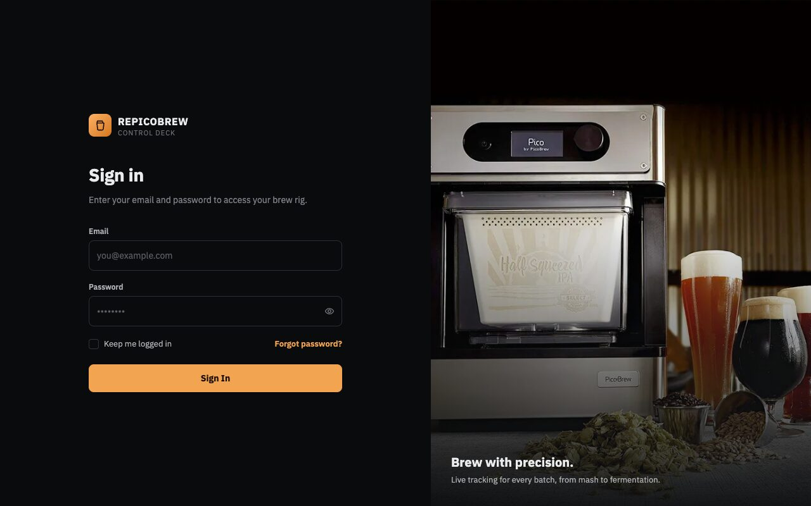
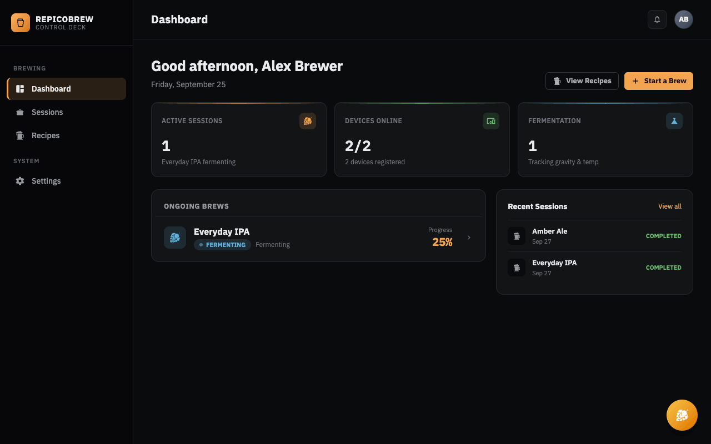
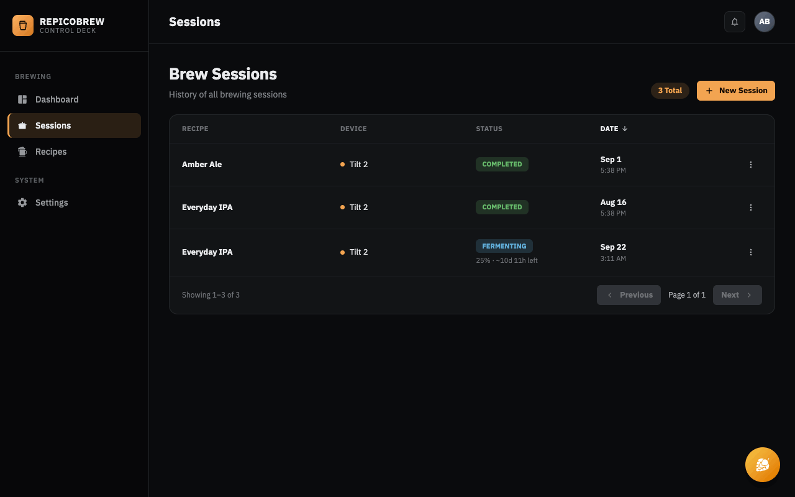
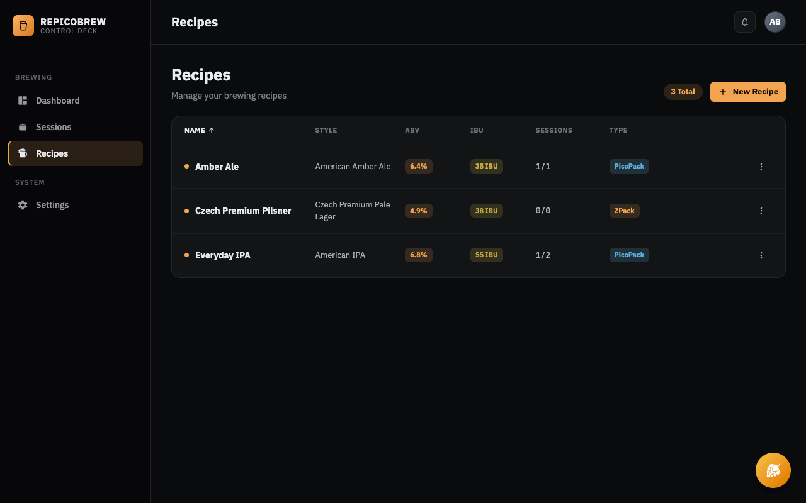
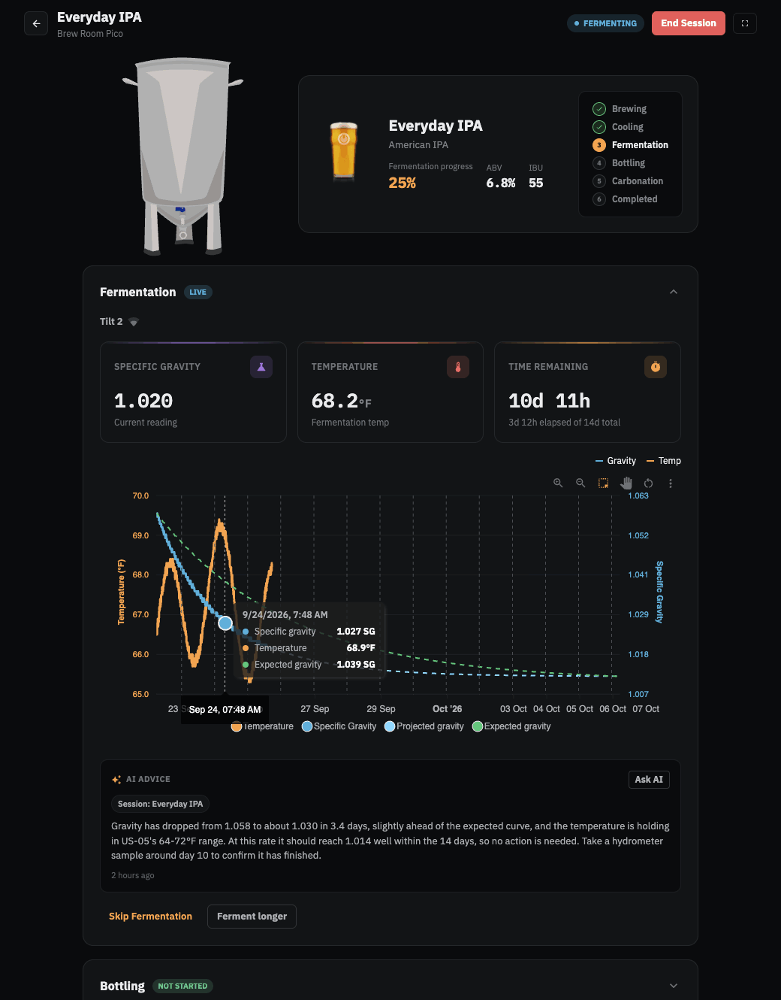
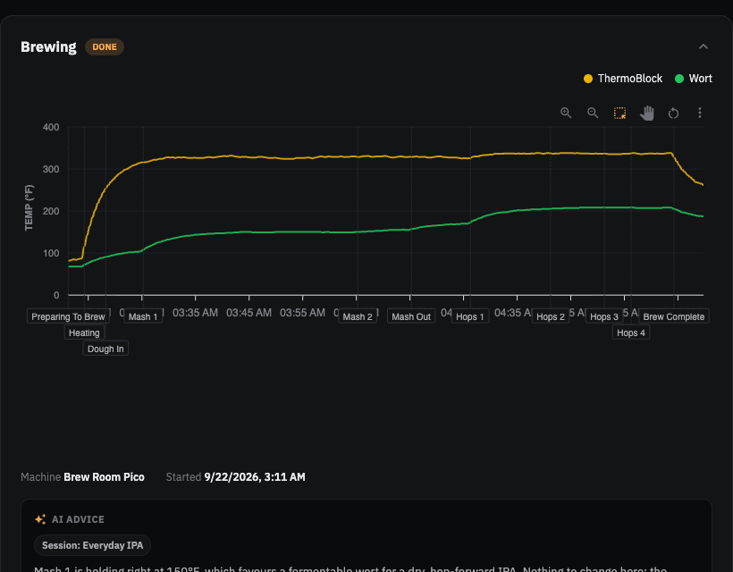
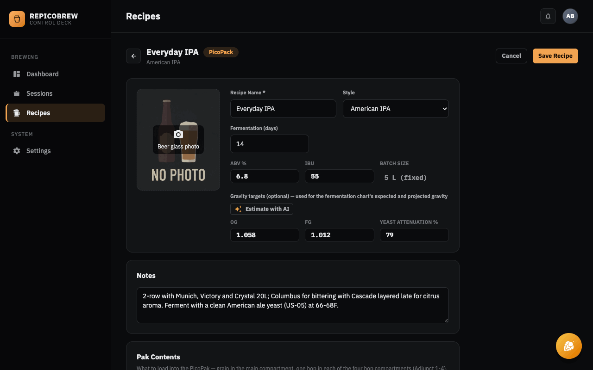
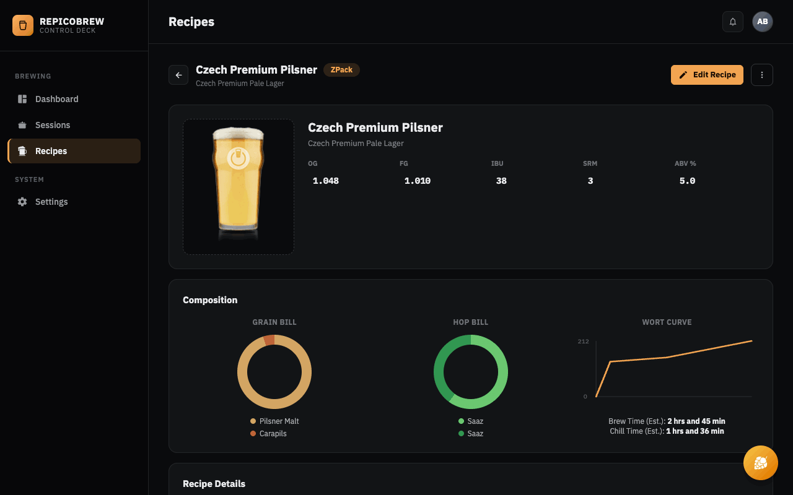
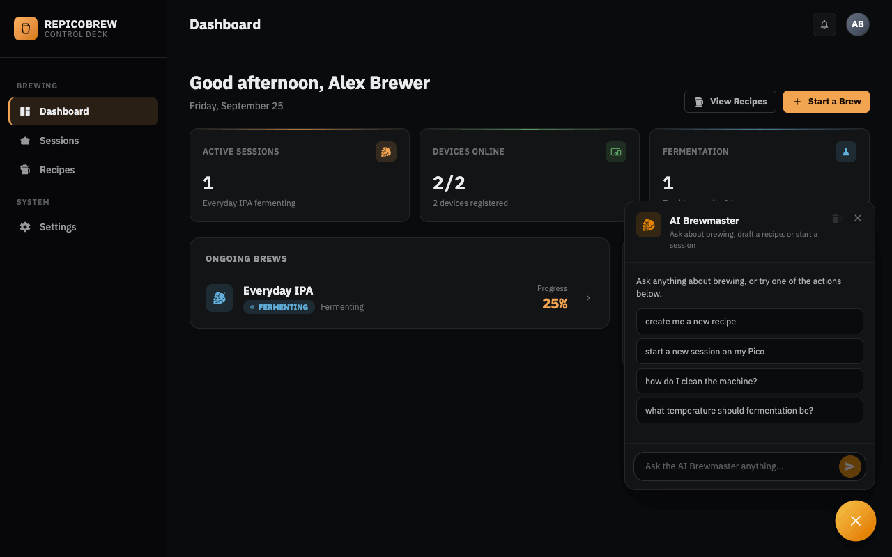
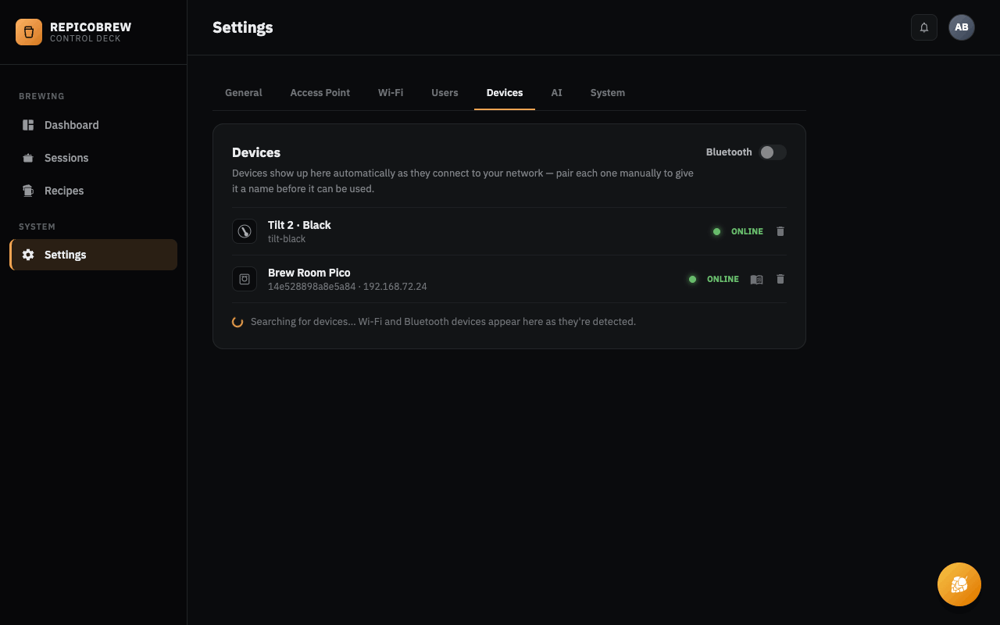

# RePicoBrew

A PicoBrew server as an alternative to [chiefwigms/picobrew_pico](https://github.com/chiefwigms/picobrew_pico) written in TypeScript with an improved UX using React Router + Tailwind CSS.

## Screenshots

<table>
  <tr>
    <td align="center" valign="top"><a href="docs/screenshots/signin.jpg"></a><br><sub>Sign in</sub></td>
    <td align="center" valign="top"><a href="docs/screenshots/dashboard.png"></a><br><sub>Dashboard: active sessions, devices and ongoing brews</sub></td>
  </tr>
  <tr>
    <td align="center" valign="top"><a href="docs/screenshots/sessions.png"></a><br><sub>Session history</sub></td>
    <td align="center" valign="top"><a href="docs/screenshots/recipes.png"></a><br><sub>Recipes: PicoPacks and ZPacks</sub></td>
  </tr>
  <tr>
    <td align="center" valign="top"><a href="docs/screenshots/session-fermentation.png"></a><br><sub>Fermentation: live gravity and temperature, expected and projected gravity, AI advice</sub></td>
    <td align="center" valign="top"><a href="docs/screenshots/session-brew.png"></a><br><sub>Brew chart with each Pico step marked</sub></td>
  </tr>
  <tr>
    <td align="center" valign="top"><a href="docs/screenshots/recipe-picopack-edit.png"></a><br><sub>PicoPack editor, with AI-estimated gravity targets</sub></td>
    <td align="center" valign="top"><a href="docs/screenshots/recipe-zpack.png"></a><br><sub>ZPack recipe details</sub></td>
  </tr>
  <tr>
    <td align="center" valign="top"><a href="docs/screenshots/ai-brewmaster.png"></a><br><sub>AI Brewmaster: chat, draft recipes, start sessions</sub></td>
    <td align="center" valign="top"><a href="docs/screenshots/settings-devices.png"></a><br><sub>Devices: Pico, Tilt and Bluetooth</sub></td>
  </tr>
</table>

<sub>Screenshots show demo data (sample recipes, brews and AI advice); click any image for the full size.</sub>

**Completed Phases:**

- **Phase 1:** Pico C brew sessions with live progress tracking ✅
- **Phase 2:** Tilt Fermentation Monitoring with BLE support ✅

- [Project Plan](PLAN.md)
- [React Router Docs](https://reactrouter.com/)
- [Raspberry Pi Deployment Guide](DEPLOY_PI.md) — manual setup on an existing Pi
- [Raspberry Pi Image Builder](pi-image/README.md) — build a ready-to-flash `.img` that boots with zero internet/setup needed

## Features

### Phase 1: Brewing

- **Device Management:** Register and manage Pico C devices
- **Recipe CRUD:** Create, edit, and manage brew recipes with Pico-specific constraints
- **Live Brew Tracking:** Real-time brew progress with animated visualization
- **Session History:** Review past brews with temperature graphs and step timelines
- **Raspberry Pi AP Mode:** Run as a WiFi access point that spoofs `picobrew.com`

### Phase 2: Fermentation

- **Tilt Hydrometer Support:** All 8 Tilt colors (Red, Green, Black, Purple, Orange, Blue, Yellow, Pink)
- **BLE Scanning:** Built-in Bluetooth Low Energy scanning on Raspberry Pi
- **Live Fermentation Tracking:** Real-time gravity and temperature monitoring
- **Fermentation Sessions:** Start/stop tracking with complete history
- **Dual-Axis Charts:** Temperature and specific gravity over time
- **HTTP Fallback:** API endpoint for pytilt or testing without BLE

## Development

From your terminal:

```sh
pnpm install
pnpm dev
```

This starts your app in development mode, rebuilding assets on file changes.

## Deployment

Build for production, then run it:

```sh
pnpm build
pnpm start
```

This project is meant to run on a Raspberry Pi as a WiFi access point spoofing `picobrew.com` —
see the two real deployment paths:

- [Raspberry Pi Image Builder](pi-image/README.md) — build a ready-to-flash `.img` that boots with
  zero internet/setup needed on the Pi. The recommended path.
- [Raspberry Pi Deployment Guide](DEPLOY_PI.md) — manual, step-by-step setup on a Pi you already
  have running Raspberry Pi OS.
